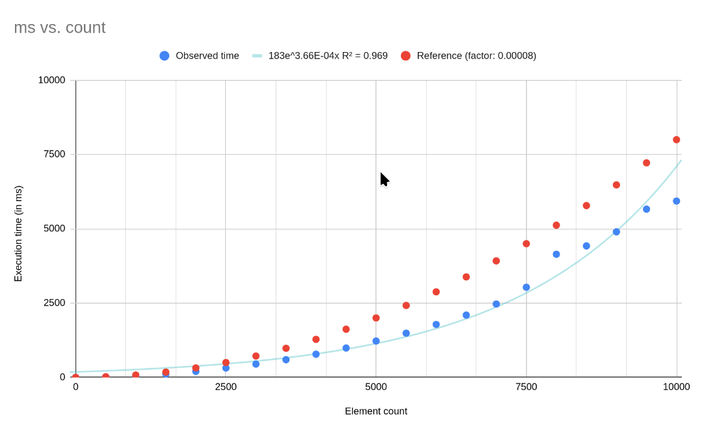

# swift-project
Idk

## Development

Run the project using `swift run swift-project [subcommand]`

Run tests with `swift test`

# Questions

## Question 7
Element count	Observed time
0	0
500	12
1000	50
1500	113
2000	202
2500	314
3000	448
3500	595
4000	779
4500	990
5000	1225
5500	1489
6000	1782
6500	2097
7000	2468
7500	3033
8000	4145
8500	4425
9000	4900
9500	5661
10,000.00	5934

On observe donc que le temps d'exécution est proportionnel à n^2, ce qui est compatible avec la complexité théorique de l'algorithme de tri par insertion.

